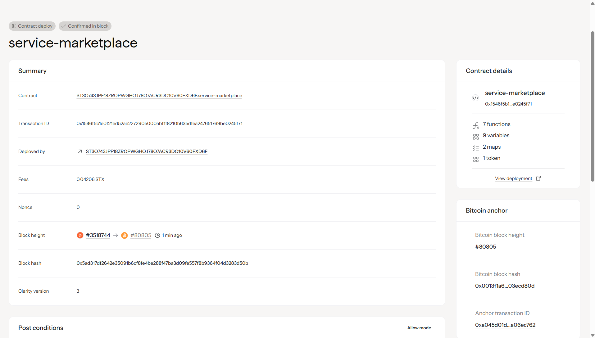

# Service Marketplace

## Project Description

The Service Marketplace is a decentralized smart contract built on the Stacks blockchain using Clarity. It enables users to create a peer-to-peer marketplace where service providers can list their services and customers can purchase them using tokens. The platform facilitates secure, transparent transactions without the need for intermediaries.

Key features:
- **Service Listing**: Providers can list their services with title, description, and price
- **Token-based Payments**: All transactions are conducted using marketplace tokens
- **Decentralized**: No central authority controls the marketplace
- **Transparent**: All transactions are recorded on the blockchain
- **Secure**: Smart contract ensures payment security and service delivery tracking

## Project Vision

Our vision is to create a trustless, decentralized service marketplace that empowers individuals and businesses to:

1. **Eliminate Intermediaries**: Direct peer-to-peer transactions between service providers and consumers
2. **Reduce Transaction Costs**: Lower fees compared to traditional marketplace platforms
3. **Ensure Transparency**: All transactions and service listings are publicly verifiable on the blockchain
4. **Global Accessibility**: Enable cross-border service transactions without geographical restrictions
5. **Build Trust**: Smart contract automation ensures secure and reliable transactions

We envision a future where anyone can monetize their skills and services globally, while customers can access a wide range of services with complete confidence in the transaction process.

## Future Scope

### Short-term Enhancements (Next 6 months)
- **Service Categories**: Implement categorization system for better service discovery
- **Rating and Review System**: Allow customers to rate services and leave reviews
- **Escrow Mechanism**: Hold payments in escrow until service completion confirmation
- **Service Completion Verification**: Multi-step verification process for service delivery

### Medium-term Developments (6-12 months)
- **Multi-token Support**: Accept various cryptocurrencies and tokens as payment
- **Dispute Resolution**: Implement a decentralized arbitration system
- **Service Templates**: Pre-defined service categories with standardized parameters
- **Bulk Purchase Options**: Allow customers to purchase multiple services in a single transaction
- **Subscription Services**: Support for recurring service payments

### Long-term Goals (1+ years)
- **Cross-chain Compatibility**: Extend to other blockchain networks
- **AI-powered Matching**: Intelligent service recommendation system
- **Reputation System**: Comprehensive reputation scoring for providers and customers
- **Mobile DApp**: Dedicated mobile application for marketplace access
- **Integration APIs**: Third-party integration capabilities for external platforms
- **Advanced Analytics**: Comprehensive marketplace analytics and insights dashboard

### Technical Roadmap
- **Layer 2 Integration**: Implement scaling solutions for faster, cheaper transactions
- **IPFS Integration**: Decentralized storage for service documentation and media
- **Oracle Integration**: Real-world data integration for service verification
- **DAO Governance**: Community-driven platform governance and decision making

## Contract Address

**Testnet Contract Address**: `ST1PQHQKV0RJXZFY1DGX8MNSNYVE3VGZJSRTPGZGM.service-marketplace`

**Mainnet Contract Address**: *To be deployed*

### Deployment Information
- **Network**: Stacks Blockchain
- **Language**: Clarity
- **Compiler Version**: Clarity 2.0
- **Last Updated**: August 2025

### Contract Functions

#### Public Functions
1. **`list-service`**: Create a new service listing
   - Parameters: `title`, `description`, `price`
   - Returns: Service ID

2. **`purchase-service`**: Purchase an existing service
   - Parameters: `service-id`, `payment-amount`
   - Returns: Transaction confirmation

#### Read-only Functions
- **`get-service`**: Retrieve service details by ID
- **`get-user-balance`**: Check user's token balance
- **`get-total-services`**: Get total number of listed services
- **`get-next-service-id`**: Get the next available service ID

### Getting Started

1. **Deploy the Contract**: Deploy the contract to Stacks testnet/mainnet
2. **Add Initial Balance**: Use the `add-balance` function to add tokens to user accounts
3. **List Services**: Service providers can use `list-service` to create listings
4. **Purchase Services**: Customers can use `purchase-service` to buy services

### Testing

The contract includes comprehensive error handling and validation:
- Input validation for all parameters
- Balance verification before transactions
- Service existence and availability checks
- Prevention of self-purchases

For testing purposes, the contract owner can use the `add-balance` function to distribute tokens to test accounts.

## Contract Details
Contract Address: ST3Q743JPF18ZRQPWGHQJ78Q7ACR3DQ10V60FXD6F.service-marketplace

---
